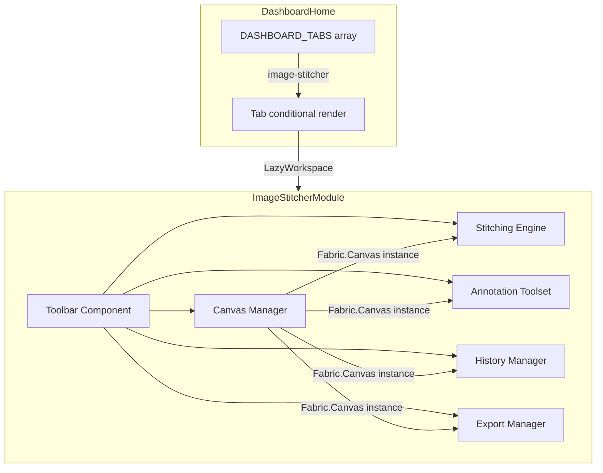

# Technical Design: Image Stitcher Tool (图片拼接工具)

## Overview

The Image Stitcher Tool is a new dashboard module that provides a Fabric.js-based canvas workspace for image stitching, annotation, and export. It integrates into the existing dashboard tab system as a publicly accessible tab positioned immediately after "pareto-analysis".

The module follows the established dashboard pattern:
- Registered in `DASHBOARD_TABS` array
- Lazy-loaded via `React.lazy` + dynamic `import()`
- Rendered inside `<LazyWorkspace>` when its tab is active
- Self-contained workspace component in `client/src/pages/dashboard/components/`

Key technical decisions:
- **Fabric.js** (new dependency) for canvas management — provides object model, serialization, free drawing, and export APIs out of the box
- **JSON state snapshots** for undo/redo — leverages `canvas.toJSON()` / `canvas.loadFromJSON()`
- **No server-side component** — all processing is client-side (image loading, stitching, export)

## Architecture



The module is structured as a single top-level component (`ImageStitcherWorkspace`) that composes:
1. **Toolbar** — tool selection, action buttons, property controls
2. **Canvas Manager** — initializes and manages the Fabric.js canvas, handles zoom/pan
3. **Stitching Engine** — pure functions for vertical/horizontal stitching calculations
4. **Annotation Toolset** — tool mode state machine (select, text, shape, brush)
5. **History Manager** — undo/redo stack using JSON snapshots
6. **Export Manager** — high-resolution PNG generation and download

## Components and Interfaces

### File Structure

```
client/src/pages/dashboard/components/
├── ImageStitcherWorkspace.tsx        # Top-level module component
├── image-stitcher/
│   ├── useCanvasManager.ts           # Hook: canvas init, zoom, pan
│   ├── useHistoryManager.ts          # Hook: undo/redo state stack
│   ├── stitchingEngine.ts            # Pure functions: vertical/horizontal stitch
│   ├── ImageStitcherToolbar.tsx       # Toolbar UI component
│   ├── ImageDropZone.tsx             # Drag-and-drop + file picker
│   └── types.ts                      # Shared types
```

### Key Interfaces

```typescript
// types.ts
export type ToolMode = 'select' | 'text' | 'rect' | 'arrow' | 'brush';

export type StitchDirection = 'vertical' | 'horizontal';

export interface ImageEntry {
  id: string;
  name: string;
  element: HTMLImageElement;
  width: number;
  height: number;
}

export interface HistoryState {
  past: string[];      // JSON snapshots
  present: string;     // current canvas JSON
  future: string[];    // redo stack
}

export interface CanvasManagerAPI {
  canvas: fabric.Canvas | null;
  zoomToPoint: (point: { x: number; y: number }, zoom: number) => void;
  resetView: () => void;
  setCanvasDimensions: (width: number, height: number) => void;
}
```

### useCanvasManager Hook

```typescript
function useCanvasManager(containerRef: RefObject<HTMLDivElement>): CanvasManagerAPI
```

Responsibilities:
- Initialize `fabric.Canvas` on mount, dispose on unmount
- Resize canvas to fill container (ResizeObserver)
- Mouse wheel → zoom (centered on cursor, clamped 0.1x–5x)
- Spacebar held → pan mode (grab cursor, mouse drag pans viewport)
- Spacebar released → restore previous tool mode

### useHistoryManager Hook

```typescript
function useHistoryManager(canvas: fabric.Canvas | null): {
  undo: () => void;
  redo: () => void;
  record: () => void;
  canUndo: boolean;
  canRedo: boolean;
}
```

Responsibilities:
- `record()` — push `canvas.toJSON()` onto past stack, clear future
- `undo()` — pop from past, push present to future, load popped state
- `redo()` — pop from future, push present to past, load popped state
- Expose `canUndo` / `canRedo` booleans for button disabled state

### stitchingEngine.ts

```typescript
export interface StitchLayout {
  canvasWidth: number;
  canvasHeight: number;
  placements: Array<{ imageId: string; x: number; y: number; scaleX: number; scaleY: number }>;
}

export function computeVerticalStitch(images: ImageEntry[]): StitchLayout;
export function computeHorizontalStitch(images: ImageEntry[]): StitchLayout;
```

Pure functions — no side effects, no canvas dependency. They compute layout geometry only.

### ImageStitcherToolbar

Props:
- `activeTool: ToolMode`
- `onToolChange: (tool: ToolMode) => void`
- `onStitch: (direction: StitchDirection) => void`
- `onUndo / onRedo: () => void`
- `canUndo / canRedo: boolean`
- `onExport: () => void`
- `brushWidth / brushColor / fontSize / fontColor` — annotation property controls

### ImageDropZone

Props:
- `onImagesLoaded: (images: ImageEntry[]) => void`
- `acceptedFormats: string[]` (default: `['image/png', 'image/jpeg', 'image/webp']`)

Handles drag-and-drop events and file input dialog. Validates MIME types, shows error toast for unsupported files.

## Data Models

### Canvas State (Fabric.js JSON)

The canvas state is serialized via `canvas.toJSON()` which produces:

```typescript
interface FabricCanvasJSON {
  version: string;
  objects: FabricObjectJSON[];
  background?: string;
}
```

This is the format stored in the undo/redo history stack. Each snapshot is a complete canvas state.

### Image Queue

```typescript
interface ImageEntry {
  id: string;           // nanoid-generated unique ID
  name: string;         // original filename
  element: HTMLImageElement;  // loaded DOM element
  width: number;        // natural pixel width
  height: number;       // natural pixel height
}
```

Images are held in component state as an ordered array. The order determines stitch sequence.

### Stitch Layout (computed, not persisted)

```typescript
interface StitchLayout {
  canvasWidth: number;
  canvasHeight: number;
  placements: Array<{
    imageId: string;
    x: number;
    y: number;
    scaleX: number;
    scaleY: number;
  }>;
}
```

Computed by the stitching engine from the image queue. Used to position `fabric.Image` objects on canvas.

### Tool State

```typescript
interface ToolState {
  mode: ToolMode;
  brushWidth: number;       // default: 3
  brushColor: string;       // default: '#ff0000'
  fontSize: number;         // default: 20
  fontColor: string;        // default: '#ff0000'
}
```

Managed via `useState` in the top-level workspace component. Passed down to toolbar and canvas event handlers.


## Correctness Properties

*A property is a characteristic or behavior that should hold true across all valid executions of a system — essentially, a formal statement about what the system should do. Properties serve as the bridge between human-readable specifications and machine-verifiable correctness guarantees.*

### Property 1: Vertical stitch layout correctness

*For any* non-empty ordered list of images with positive dimensions, `computeVerticalStitch` shall produce a layout where:
- The canvas width equals the maximum image width (base width)
- Each image is scaled such that its new width equals the base width and its new height equals `originalHeight × (baseWidth / originalWidth)`
- Each image's Y position equals the sum of scaled heights of all preceding images
- Each image's X position is 0
- The canvas height equals the sum of all scaled image heights

**Validates: Requirements 4.2, 4.3, 4.4, 4.5, 4.6**

### Property 2: Horizontal stitch layout correctness

*For any* non-empty ordered list of images with positive dimensions, `computeHorizontalStitch` shall produce a layout where:
- The canvas height equals the maximum image height (base height)
- Each image is scaled such that its new height equals the base height and its new width equals `originalWidth × (baseHeight / originalHeight)`
- Each image's X position equals the sum of scaled widths of all preceding images
- Each image's Y position is 0
- The canvas width equals the sum of all scaled image widths

**Validates: Requirements 5.2, 5.3, 5.4, 5.5, 5.6**

### Property 3: Image queue order preservation

*For any* sequence of images provided to the upload handler, the resulting image queue shall maintain the same relative order as the input sequence.

**Validates: Requirements 3.3, 3.5**

### Property 4: Unsupported file rejection

*For any* file whose MIME type is not in the set `{image/png, image/jpeg, image/webp}`, the upload handler shall reject it and the image queue shall remain unchanged.

**Validates: Requirements 3.6**

### Property 5: Undo/redo round trip

*For any* sequence of canvas state changes, performing an undo followed by a redo shall restore the canvas JSON to the state it was in before the undo. Conversely, for any state, performing a change then an undo shall restore the canvas JSON to the state before the change.

**Validates: Requirements 10.2, 10.3, 10.4**

### Property 6: Delete removes object from canvas

*For any* canvas containing one or more objects, selecting an object and triggering delete shall result in the canvas object count decreasing by one, and the deleted object's ID shall no longer appear in the canvas objects list.

**Validates: Requirements 6.5**

### Property 7: Text creation at click position

*For any* click coordinate (x, y) on the canvas while the text tool is active, a new text object shall be created with its `left` equal to x and its `top` equal to y.

**Validates: Requirements 7.2**

### Property 8: Rectangle creation with correct properties

*For any* drag from point (x1, y1) to point (x2, y2) while the rectangle tool is active, a rectangle object shall be created with no fill (`fill = 'transparent'` or empty), a red stroke color, and dimensions matching the drag extent.

**Validates: Requirements 8.2, 8.3**

### Property 9: Arrow creation with arrowhead

*For any* drag from point (x1, y1) to point (x2, y2) while the arrow tool is active, a line/group object shall be created connecting those two points, with an arrowhead indicator at the end point (x2, y2).

**Validates: Requirements 8.4, 8.5**

### Property 10: Brush drawing mode and stroke properties

*For any* brush thickness and color configuration, when the brush tool is active, `canvas.isDrawingMode` shall be `true`, and `canvas.freeDrawingBrush.width` shall equal the configured thickness, and `canvas.freeDrawingBrush.color` shall equal the configured color.

**Validates: Requirements 9.2, 9.3, 9.4, 9.5**

### Property 11: Export at logical dimensions regardless of zoom

*For any* canvas with logical dimensions W×H and any viewport zoom level Z, the exported PNG data shall have pixel dimensions W×H (not W×Z × H×Z).

**Validates: Requirements 11.2, 11.3**

### Property 12: Zoom centered on cursor position

*For any* cursor position (cx, cy) on the canvas and any zoom delta, after zooming, the canvas point under the cursor shall remain at the same screen position.

**Validates: Requirements 2.2**

### Property 13: Tool mode restoration after spacebar release

*For any* active tool mode T, holding spacebar (entering pan mode) and then releasing spacebar shall restore the active tool mode to T.

**Validates: Requirements 2.5**

## Error Handling

| Scenario | Handling |
|----------|----------|
| Unsupported file type dropped/selected | Show toast error with filename; do not add to queue |
| Image fails to load (corrupt/network) | Show toast error; skip image; continue loading others |
| Canvas initialization failure | Show fallback error UI with retry button |
| Export fails (canvas empty) | Disable export button when canvas has no objects |
| Undo on empty history | Disable undo button (`canUndo = false`) |
| Redo on empty future | Disable redo button (`canRedo = false`) |
| Browser memory pressure (very large images) | No explicit handling; rely on browser limits; consider warning for images > 10MB |

## Testing Strategy

### Unit Tests (Vitest)

Focus on specific examples and edge cases:
- Stitching engine with known image dimensions → verify exact layout coordinates
- Empty image list → stitching functions return sensible defaults or throw
- Single image → stitch produces layout with no scaling needed
- File validation with various MIME types
- History manager: undo at start of history, redo at end of history
- Tab registration: verify 'image-stitcher' is in DASHBOARD_TABS after 'pareto-analysis'

### Property-Based Tests (fast-check + Vitest)

Library: **fast-check** (standard PBT library for TypeScript/JavaScript)

Configuration:
- Minimum 100 iterations per property test (`fc.assert(..., { numRuns: 100 })`)
- Each test tagged with a comment referencing the design property

Tag format: `// Feature: image-stitcher-tool, Property {N}: {title}`

Properties to implement:
1. **Vertical stitch layout correctness** — generate random arrays of `{width, height}` pairs, verify all layout invariants
2. **Horizontal stitch layout correctness** — same approach, horizontal direction
3. **Image queue order preservation** — generate random file lists, verify order maintained
4. **Unsupported file rejection** — generate random MIME types not in accepted set, verify rejection
5. **Undo/redo round trip** — generate random sequences of state snapshots, verify round-trip
6. **Delete removes object** — generate random canvas object counts, verify deletion decrements
7. **Text creation at click position** — generate random (x, y) coordinates, verify placement
8. **Rectangle creation properties** — generate random drag coordinates, verify rect properties
9. **Arrow creation with arrowhead** — generate random drag coordinates, verify arrow structure
10. **Brush mode and stroke properties** — generate random width/color values, verify canvas state
11. **Export dimensions** — generate random canvas dimensions and zoom levels, verify export size
12. **Zoom centered on cursor** — generate random cursor positions and zoom deltas, verify invariant
13. **Tool mode restoration** — generate random tool modes, verify spacebar round-trip

The stitching engine tests (Properties 1 & 2) are the highest-value PBT targets since they are pure functions with well-defined mathematical invariants. Properties 3–5 are also strong candidates as they test pure logic. Properties 6–13 may require canvas mocking but remain valuable for verifying the integration logic.

Each correctness property above MUST be implemented by a SINGLE property-based test function. Unit tests complement these by covering specific edge cases (empty inputs, single image, boundary values).
